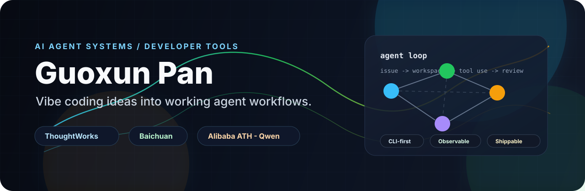

  

  
  
  

  

## Hi, I'm Guoxun

I build AI-native developer tools and agent systems that can move from an interesting demo to a workflow people can actually use.

我现在在 **Alibaba ATH · Qwen**，之前在 **ThoughtWorks** 和 **Baichuan**。我关注的是：怎么把一个新的想法快速 vibe coding 出原型，再把它推进到可观察、可复盘、可持续迭代的 agent 工程系统。

## What I'm exploring

| Direction | What I like building |
| --- | --- |
| Agent orchestration | Issue-driven agents, isolated workspaces, tool execution, human handoff |
| Developer experience | CLI/TUI workflows, local automation, fast feedback loops |
| LLM engineering | Context engineering, tool calling, prompt-to-workflow systems |
| Product experiments | Small sharp ideas, quick prototypes, then hardening what survives |

## Current agent lab

  
  

  
  

## Stack I reach for

  
  
  
  
  
  
  
  

## GitHub signal

  
  

## Open thread

I'm always interested in practical agent infrastructure: agents that can read an issue, change code, report progress, ask for help at the right time, and leave a trace humans can trust.

中文 / English both work. If you're building around AI agents, CLI automation, or AI-native engineering workflows, start from one of the repos above.
